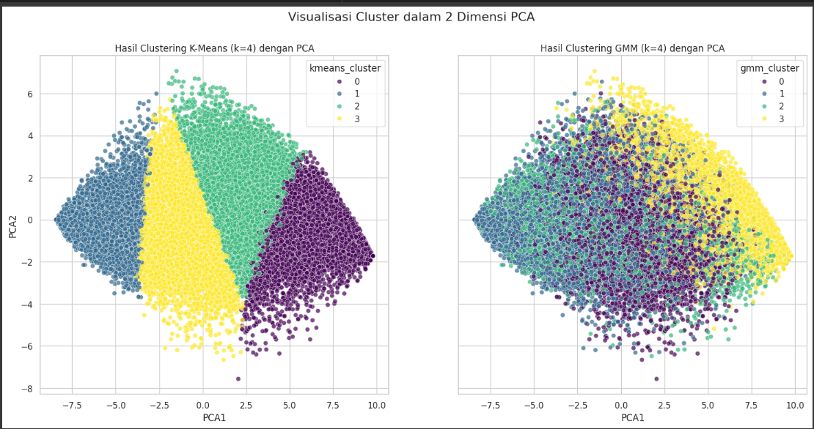
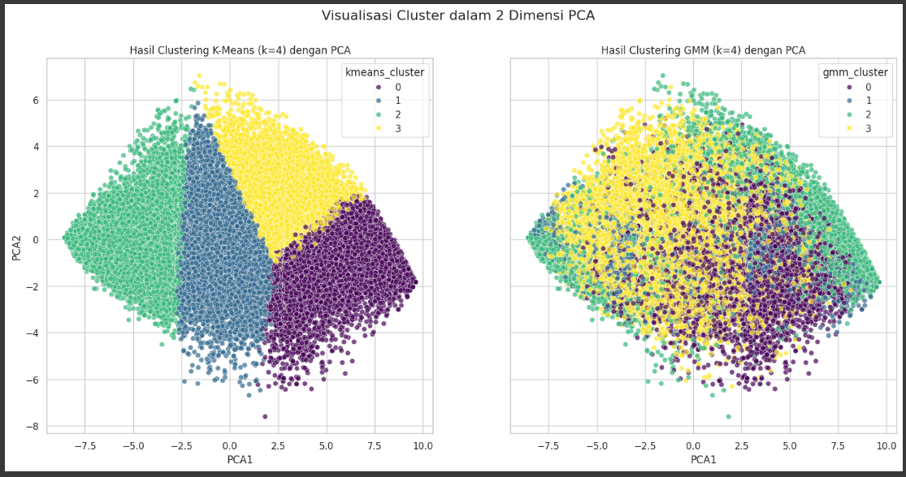

# 🧠 **Analisis Perbandingan Clustering DASS (Depression Anxiety Stress) Menggunakan K-Means dan GMM Sebelum dan Sesudah Penyeimbangan Data dengan ADASYN**

---

## 📋 **Deskripsi Singkat Proyek**

Proyek ini bertujuan menerapkan teknik **clustering** untuk mendeteksi potensi gangguan kesehatan mental pada mahasiswa menggunakan hasil survei **DASS** (Depression, Anxiety, Stress Scales).  
Metode yang digunakan adalah **K-Means** dan **Gaussian Mixture Model (GMM)** untuk mengelompokkan mahasiswa berdasarkan risiko gangguan mental, serta membandingkan kinerja kedua metode tersebut sebelum dan sesudah penyeimbangan data menggunakan **ADASYN**.  
**ADASYN** membantu mengatasi ketidakseimbangan data di mana jumlah responden berisiko tinggi biasanya lebih sedikit dibandingkan kelompok risiko rendah atau sedang.

---

## 📖 **Latar Belakang Masalah**

Kesehatan mental merupakan aspek penting dalam kualitas hidup, terutama bagi mahasiswa yang sedang mengalami fase transisi menuju kedewasaan dan karier profesional. Tekanan akademik, adaptasi sosial, dan ekspektasi lingkungan sekitar menjadi pemicu utama gangguan mental.  
Menurut data WHO, sekitar **12,5%** populasi dunia mengalami gangguan mental, termasuk mahasiswa sebagai kelompok yang rentan.  
Di Indonesia, **Riskesdas 2018** melaporkan gangguan mental emosional pada usia 15+ mencapai **9,8%**. Beberapa kampus seperti **UNNES** telah menyediakan layanan konseling “Kawan Dengar” sebagai upaya penanganan.  
Metode clustering dalam penelitian ini digunakan untuk deteksi dini dan pemahaman kondisi psikologis mahasiswa.

---

## 🔍 **Deskripsi Dataset**

Dataset survei DASS yang digunakan terdiri dari **39.775 baris** dan **172 kolom**, berformat CSV, mencakup:
- **42 kolom skor DASS (Q1A–Q42A)** yang merepresentasikan tingkat depresi, kecemasan, dan stres.
- Kolom **demografis dan psikologis** lain seperti usia, jenis kelamin, dan skor kepribadian.

---

## ⚙️ **Algoritma yang Digunakan**

### K-Means Clustering  
Metode clustering berbasis centroid, mengelompokkan data berdasarkan jarak ke pusat cluster. Efektif untuk cluster dengan bentuk seragam dan jelas.

### Gaussian Mixture Model (GMM)  
Model probabilistik yang mengasumsikan data berasal dari campuran distribusi Gaussian. Lebih fleksibel dan mampu menangani cluster yang overlap.

### ADASYN (Adaptive Synthetic Sampling)  
Teknik penyeimbangan data dengan menghasilkan data sintetis pada kelas minoritas untuk mengurangi bias akibat ketidakseimbangan dataset.

---

## 🚀 **Panduan Menjalankan Kode**

### Prasyarat  
Pastikan pustaka Python berikut telah terpasang:  
`numpy`, `pandas`, `matplotlib`, `seaborn`, `scikit-learn`, `imbalanced-learn`  

Instalasi dengan:  
```bash
pip install numpy pandas matplotlib seaborn scikit-learn imbalanced-learn
```

### Menjalankan Eksperimen Tanpa Penyeimbangan Data

📂 **Notebook:** [Clustering tanpa Penyeimbangan Data](./notebooks/clustering_tanpa_penyeimbangan.ipynb)

### Cara menjalankan:
- Buka notebook tersebut di Jupyter Notebook, JupyterLab, atau Google Colab.
- Jalankan setiap sel secara berurutan dengan menekan Shift + Enter.

### Apa yang akan dilakukan pada notebook ini?
- **Eksplorasi Data (EDA)**  
  Memahami struktur data, mengecek nilai yang hilang, dan mengevaluasi distribusi kelas responden.
  
- **Pembersihan Data**  
  Menghapus data yang tidak valid menggunakan `Vocabulary Check List (VCL)`.

- **Normalisasi Data**  
  Menggunakan `StandardScaler` untuk menstandarisasi fitur agar model tidak bias karena perbedaan skala.

- **Clustering dengan K-Means dan GMM**  
  Mengelompokkan data ke dalam cluster berdasarkan fitur yang sudah diproses.

- **Visualisasi Hasil**  
  Menggunakan `PCA` untuk mereduksi dimensi dan menampilkan hasil clustering dalam bentuk scatter plot.

### Menjalankan Eksperimen dengan Penyeimbangan Data (ADASYN)

📂 **Notebook:** [Clustering dengan Penyeimbangan Data](./notebooks/clusteringg_dengan_penyeimbangan.ipynb)

### Cara menjalankan:
- Buka notebook ini setelah menyelesaikan eksperimen tanpa penyeimbangan.
- Jalankan semua sel secara berurutan dengan Shift + Enter.

### Apa yang akan dilakukan pada notebook ini?
- **Penyeimbangan Data dengan ADASYN**  
  Menghasilkan data sintetis untuk kelas minoritas agar distribusi data lebih seimbang.

- **Clustering dengan K-Means dan GMM**  
  Melakukan clustering ulang pada data yang sudah diseimbangkan.

- **Evaluasi dan Visualisasi**  
  Menggunakan metrik **Silhouette Score** dan **BIC** (untuk GMM) untuk evaluasi kualitas cluster.  
  Visualisasi cluster dengan PCA untuk memudahkan interpretasi.

- **Perbandingan Hasil**  
  Membandingkan hasil clustering sebelum dan sesudah penyeimbangan untuk melihat dampak teknik ADASYN terhadap performa model.
  
---

## 📊 **Contoh Hasil Output dan Visualisasi**

Pada bagian ini, kami menyajikan contoh hasil output dan visualisasi yang dihasilkan dari penerapan algoritma **K-Means** dan **Gaussian Mixture Model (GMM)** untuk proses clustering, beserta evaluasi model dan visualisasi menggunakan **Principal Component Analysis (PCA)**.

### Interpretasi dan Visualisasi Hasil

Hasil clustering divisualisasikan dengan metode **PCA** yang mereduksi dimensi data menjadi dua komponen utama sehingga memudahkan pemahaman pola dan pemisahan antar cluster.

### Visualisasi Clustering Tanpa Penyeimbangan Data (ADASYN)



*Gambar 1: Visualisasi cluster hasil clustering tanpa menggunakan teknik penyeimbangan data.*

### Visualisasi Clustering Dengan Penyeimbangan Data (ADASYN)



*Gambar 2: Visualisasi cluster hasil clustering setelah penyeimbangan data dengan ADASYN.*

---

## 📝 **Kesimpulan**

Penelitian ini berhasil mengelompokkan responden berdasarkan data **Depression Anxiety Stress Scales (DASS)** menggunakan metode clustering **K-Means** dan **Gaussian Mixture Model (GMM)**.

### Kualitas Data dan Preprocessing  
Proses preprocessing efektif dengan:  
- Pembersihan data menggunakan `Vocabulary Check List (VCL)` untuk menghapus data tidak valid.  
- Normalisasi fitur menggunakan `StandardScaler` agar skala fitur seragam.  
- Penyeimbangan data dengan `ADASYN` yang menghasilkan data sintetis untuk kelas minoritas, meningkatkan representasi dan akurasi clustering.

### Pemilihan Metode Clustering  
- **K-Means** menghasilkan cluster yang jelas tetapi kurang efektif untuk data dengan overlap cluster.  
- **GMM** lebih fleksibel dan mampu menangani tumpang tindih cluster karena model probabilistiknya.  
Kedua metode berhasil membagi data menjadi **empat cluster optimal** berdasarkan tingkat risiko psikologis, dari rendah hingga tinggi.

### Evaluasi Model  
Penentuan jumlah cluster optimal menggunakan:  
- **Elbow Method** untuk melihat penurunan WCSS.  
- **Silhouette Score** untuk menilai kualitas cluster (nilai lebih tinggi lebih baik).  
- **Bayesian Information Criterion (BIC)** khusus untuk GMM dalam memilih model terbaik.  

Nilai **Silhouette Score** yang baik dan peningkatan setelah penyeimbangan data menegaskan validitas clustering.

---
